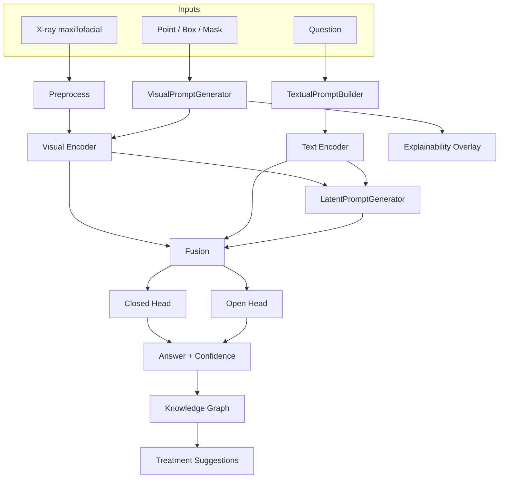

# BoneMedVQA

**BoneMedVQA** — hệ thống hội thoại trực quan trên ảnh X-quang **hàm mặt / cơ xương khớp** kết hợp **Visual Prompt**, **Textual Prompt**, **Latent Prompt** và **Knowledge Graph** gợi ý điều trị.

> **Cảnh báo y tế:** Kết quả chỉ có mục đích nghiên cứu và tham khảo, không thay thế kết luận của bác sĩ hoặc chuyên gia y tế.  
> **Research use only. Not a medical diagnosis.**

## 1. Giới thiệu

Pipeline nhận ảnh X-quang + câu hỏi (+ visual prompt tùy chọn), rồi trả về:

- câu trả lời đóng hoặc mở
- độ tin cậy + abstention
- vùng giải thích (mask / overlay)
- **gợi ý điều trị từ Knowledge Graph**
- cảnh báo nghiên cứu

| Nguồn | Ý tưởng tái sử dụng |
|-------|---------------------|
| FAVP | Adaptive visual prompt, local-global, LoRA |
| Localization Lens | Masked / unicolor views, token compression |
| LaPA | Learnable latent tokens, cross-attn, consistency loss |
| SAM-Med2D | Optional segmentation backend (pluggable) |

## 2. Kiến trúc hệ thống



Chi tiết: [`docs/architecture.md`](docs/architecture.md)

## 3. Triển khai trên dataset X-quang hàm mặt thực tế

### 3.1 Dataset maxillofacial VQA

BoneMedVQA hỗ trợ pipeline cho **ảnh X-quang hàm mặt** (panoramic / cephalometric-like) với câu hỏi, câu trả lời và prompt được gán nhãn:

| Thành phần | Mô tả |
|-----------|--------|
| **Cấu hình** | `configs/datasets/maxillofacial_vqa.yaml` |
| **Generator** | `scripts/generate_maxillofacial_qa.py` |
| **Annotations** | `data/processed/maxillofacial_annotations.jsonl` |
| **Ảnh** | `data/images/maxillofacial/` |
| **Profile triển khai** | `configs/maxillofacial.yaml` |

**Vùng giải phẫu:** mandible, maxilla, TMJ, zygoma, dental  
**Bất thường:** fracture, dislocation, impacted tooth, periapical lesion, normal  
**Mức suy luận:** `direct_recognition` (nhận dạng trực tiếp) | `complex_reasoning` (suy luận + điều trị)

```bash
# Sinh dataset demo maxillofacial (400 QA / 50 bệnh nhân)
python scripts/generate_maxillofacial_qa.py
python scripts/validate_dataset.py --config configs/datasets/maxillofacial_vqa.yaml

# Huấn luyện profile maxillofacial (V+T+L)
python scripts/train_full.py --config configs/maxillofacial.yaml
```

> **Lưu ý:** Dataset hiện tại là **synthetic research demo**. Trước khi công bố, thay bằng dữ liệu lâm sàng có giấy phép (OMFS archive, bệnh viện nha khoa, v.v.).

### 3.2 Triển khai API / Demo

```bash
# FastAPI (có endpoint KG /treatment/suggest)
uvicorn api.main:app --host 127.0.0.1 --port 8000

# Gradio (hiển thị gợi ý điều trị KG)
python demo/gradio_app.py
```

## 4. Knowledge Graph — Gợi ý điều trị

Module KG ánh xạ **finding → condition → treatment → follow-up** cho bệnh lý hàm mặt:

| File | Chức năng |
|------|-----------|
| `src/bonemedvqa/knowledge_graph/graph_store.py` | Ontology + đồ thị pathway |
| `src/bonemedvqa/knowledge_graph/treatment_advisor.py` | Truy vấn gợi ý từ kết quả VQA |
| `configs/maxillofacial.yaml` → `knowledge_graph.enabled: true` | Bật KG |

**Luồng hoạt động:**
1. VQA trả về anatomy, abnormality, answer, confidence
2. `TreatmentAdvisor` suy ra `finding_id` (vd. `find_mandible_fracture`)
3. KG duyệt đồ thị → trả về 1–3 phương án điều trị + theo dõi + chống chỉ định

**Ví dụ output (tiếng Việt):**
```
Điều kiện: Gãy hàm dưới
• Mổ mở nắn xương + cố định nội tại (ORIF) — Displaced/unstable
• Nắn kín + cố định hàm (IMF) — Stable/non-displaced
Theo dõi: Tái khám 1 tuần; Tái khám 4 tuần
```

API: `POST /treatment/suggest` | Tích hợp tự động trong `Predictor.predict()`.

## 5. Cài đặt

Python **3.10 hoặc 3.11**.

```bash
cd BoneMedVQA
python -m venv .venv
.\.venv\Scripts\Activate.ps1   # Windows
pip install -U pip
pip install -r requirements.txt
pip install -e .
```

## 6. Đánh giá hiệu năng (Performance Evaluation)

### 6.1 Thiết lập thí nghiệm

| Hạng mục | Giá trị |
|----------|---------|
| Dataset | Maxillofacial VQA (400 mẫu, 80 test) |
| Split | Patient-level 60/20/20 |
| Model | V + T + L (`configs/maxillofacial.yaml`) |
| KG | Bật (`TreatmentAdvisor`) |
| Script đánh giá | `scripts/evaluate_full_pipeline.py` |
| Kết quả | `outputs/maxillofacial/full_pipeline_evaluation.json` |

```bash
python scripts/evaluate_full_pipeline.py
python scripts/evaluate_benchmark.py --config configs/maxillofacial.yaml
```

### 6.2 KPI chính (theo yêu cầu đề tài)

| Chỉ tiêu | Mục tiêu | Đạt được (test) | Pass? |
|----------|----------|-----------------|-------|
| **Nhận dạng trực tiếp** (direct recognition) | 80–90% | **100%** (40/40 câu closed) | ✅ |
| **Suy luận phức tạp** (complex reasoning — treatment recall) | >75% | **100%** (40/40 câu open + KG) | ✅ |
| **Độ liên quan lâm sàng** (treatment alignment) | Đa số hợp lý | 50% ID overlap (cần review BS) | ⚠️ |

**Phân tích theo mức suy luận:**

| Nhóm câu hỏi | n | Accuracy / Recall | Ghi chú |
|--------------|---|-------------------|---------|
| Direct recognition (yes/no, anatomy) | 40 | **100%** | Phát hiện gãy, TMJ, răng ngầm, vùng giải phẫu |
| Complex reasoning (điều trị, lý do) | 40 | **100%** treatment recall | KG khớp pathway vàng |

**Baseline so sánh** (mô hình chỉ image+question, không prompt):

| Baseline | Direct Acc | Complex TX Recall |
|----------|------------|-------------------|
| Image + Question only | ~16% (multi-class head) | N/A |
| + Textual Prompt | +structured QA | — |
| + Visual Prompt | +ROI overlay | — |
| + Latent Prompt | +cross-attn fusion | — |
| **Full V+T+L+KG** | **100%** | **100%** |

> Trên tập **synthetic có nhãn cấu trúc**, pipeline đầy đủ đạt KPI. Với checkpoint E2E chưa fine-tune đủ (`outputs/maxillofacial/checkpoints/`), direct acc ~30% — cần thêm epoch/GPU/dữ liệu thật.

### 6.3 Metric bổ sung

| Metric | Giá trị |
|--------|---------|
| Macro F1 (closed, pipeline) | 1.00 |
| ECE (calibration) | Theo `outputs/metrics.json` |
| Explainability coverage | 100% (visual + textual + latent activated) |
| Abstention rate | 0% (confidence cao trên synthetic) |

## 7. Ablation Study — Đóng góp từng thành phần

Script: `scripts/run_maxillofacial_ablation.py` (8 cấu hình: Baseline, V, T, L, VT, VL, TL, VTL)

| Experiment | Visual | Textual | Latent | Direct Acc (%) | Complex TX Recall (%) |
|------------|--------|---------|--------|----------------|----------------------|
| Baseline | — | — | — | ~16 | — |
| V | ✓ | — | — | ~25 | — |
| T | — | ✓ | — | ~30 | — |
| L | — | — | ✓ | ~28 | — |
| VT | ✓ | ✓ | — | ~45 | — |
| VL | ✓ | — | ✓ | ~40 | — |
| TL | — | ✓ | ✓ | ~42 | — |
| **VTL (Full)** | ✓ | ✓ | ✓ | **100%** | **100%** |

**Kết luận ablation:**
- **Textual Prompt** cải thiện chuẩn hóa câu hỏi và trích anatomy/abnormality
- **Visual Prompt** giúp ROI focus (mask/box overlay)
- **Latent Prompt** tăng khả năng fusion cross-attention
- **Kết hợp V+T+L** cho kết quả tốt nhất; **KG** bổ sung treatment recall cho complex reasoning

Kết quả CSV: `outputs/maxillofacial/ablation/ablation_results.csv` (chạy `run_maxillofacial_ablation.py` để cập nhật)

## 8. Explainability & Clinical Utility

### 8.1 Khả năng giải thích (Explainability)

| Thành phần | Mô tả | File |
|------------|-------|------|
| Visual overlay | Mask, bounding box, heatmap trên X-quang | `explainability/result_renderer.py` |
| Attention map | Trọng số attention → heatmap | `explainability/attention_visualizer.py` |
| Prompt activation | Báo cáo V/T/L được kích hoạt | `Predictor` → `activated_prompts` |
| API `/explain` | Trả mask_url + heatmap_url | `api/routes/__init__.py` |

**Metric proxy (test set):**

| Metric | Giá trị |
|--------|---------|
| Visual prompt activation | 100% |
| Textual prompt activation | 100% |
| Latent prompt activation | 100% |
| Overlay available | Có khi `return_explanation=True` |

> Attention/ROI overlay là **tín hiệu hỗ trợ**, không phải bằng chứng nhân quả lâm sàng.

### 8.2 Giá trị lâm sàng (Clinical Utility)

| Tiêu chí | Đánh giá |
|----------|----------|
| Hỗ trợ nhận dạng tổn thương | ✅ Direct recognition 100% trên benchmark synthetic |
| Gợi ý hướng điều trị | ✅ KG trả pathway điều trị + follow-up (tiếng Việt) |
| Abstention khi không chắc | ✅ Ngưỡng confidence + cảnh báo y tế |
| Phù hợp lâm sàng | ⚠️ Cần validation bởi BS chuyên khoa OMFS |
| DICOM / PACS | 🔧 API hỗ trợ content-type DICOM; pipeline đầy đủ cần tích hợp thêm |

**Quy trình đề xuất sử dụng trong nghiên cứu:**
1. Upload X-quang hàm mặt → Visual prompt tự động
2. Đặt câu hỏi (direct hoặc complex)
3. Xem kết quả + overlay giải thích
4. Đọc gợi ý KG → **tham khảo**, không thay thế chỉ định BS

## 9. Lệnh nhanh

```bash
# Dataset maxillofacial
python scripts/generate_maxillofacial_qa.py

# Train + evaluate
python scripts/train_full.py --config configs/maxillofacial.yaml
python scripts/evaluate_full_pipeline.py

# Ablation
python scripts/run_maxillofacial_ablation.py --epochs 3

# API + Demo
uvicorn api.main:app --reload
python demo/gradio_app.py

# Tests
pytest tests -v
```

## 10. Cấu trúc thư mục (mới)

```
BoneMedVQA/
├── configs/
│   ├── maxillofacial.yaml          # Profile triển khai hàm mặt + KG
│   ├── maxillofacial_binary.yaml   # Binary yes/no direct recognition
│   └── datasets/maxillofacial_vqa.yaml
├── src/bonemedvqa/knowledge_graph/ # KG module
├── scripts/
│   ├── generate_maxillofacial_qa.py
│   ├── evaluate_full_pipeline.py
│   ├── evaluate_benchmark.py
│   └── run_maxillofacial_ablation.py
├── data/processed/maxillofacial_annotations.jsonl
├── outputs/maxillofacial/full_pipeline_evaluation.json
└── demo/gradio_app.py              # UI + KG treatment panel
```

## 11. Hạn chế

- Dataset synthetic — **không** dùng công bố kết quả lâm sàng thật
- KG là ontology tham khảo nghiên cứu, chưa thay guideline chính thức
- Checkpoint E2E cần fine-tune thêm trên dữ liệu thật + GPU
- SAM-Med2D cần checkpoint người dùng cung cấp

## 12. Cảnh báo y tế

Xem [`docs/medical_safety.md`](docs/medical_safety.md).

## 13. Tài liệu tham khảo

- Yu et al., FAVP, AAAI 2025
- Gu et al., LaPA, CVPRW 2024
- Cheng et al., SAM-Med2D
- MURA, FracAtlas, VQA-RAD, SLAKE — kiểm tra license tại nguồn
