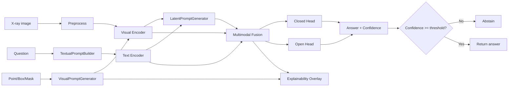

# BoneMedVQA Architecture

## Overview

BoneMedVQA combines three prompt families for musculoskeletal X-ray VQA:

1. **Visual prompt** (FAVP / Localization Lens inspired): point/box/mask → localization views.
2. **Textual prompt**: normalized task/anatomy/output-format instructions.
3. **Latent prompt** (LaPA inspired): learnable tokens with cross-attention + consistency loss.

## Pipeline

## Module map

| Module | Path | Role |
|--------|------|------|
| Visual prompt | `src/bonemedvqa/prompting/visual_prompt.py` | Mask/box/contour/views |
| Textual prompt | `src/bonemedvqa/prompting/textual_prompt.py` | Prompt normalization |
| Latent prompt | `src/bonemedvqa/prompting/latent_prompt.py` | Learnable tokens |
| Fusion | `src/bonemedvqa/models/multimodal_fusion.py` | Concat / cross-attn |
| Model | `src/bonemedvqa/models/bonemedvqa_model.py` | Full forward |
| Trainer | `src/bonemedvqa/training/trainer.py` | Train/val loop |

## Profiles

- **lightweight**: `tiny_cnn` + `tiny_text`, freeze optional, template open head.
- **full**: ResNet/BioClinicalBERT/FLAN-T5, LoRA, SAM-Med2D adapter interface.

## Safety

Heatmaps/attention are **supportive signals**, not causal proofs. Always display the research-only warning.
